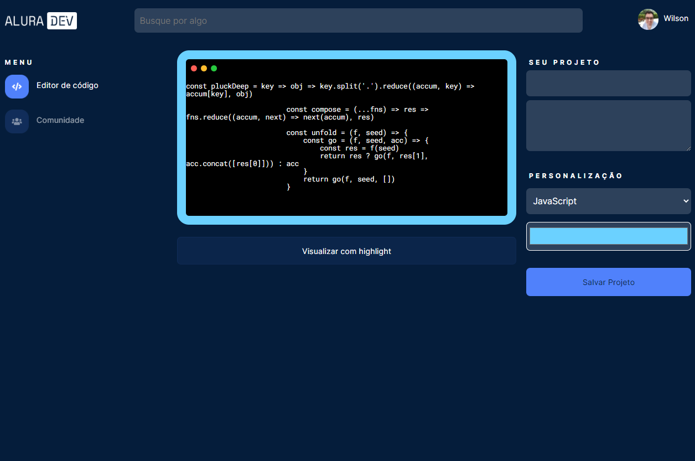

# AluraDev

O AluraDev é um app desenvolvido durante o [Alura Challenges / Front-End](https://www.alura.com.br/challenges/front-end/).

O Alura Challenges não se trata de um curso, mas sim o desafio de desenvolver um projeto.

São 4 semanas simulando um ambiente real de desenvolvimento a partir de um projeto no Figma e tarefas no Trello.

| Semana   	| Atividade principal                                                                                            	|
|----------	|----------------------------------------------------------------------------------------------------------------	|
| Semana 1 	| Desenvolver o HTML e CSS da página de editor com base no Figma.                                                	|
| Semana 2 	| Desenvolver o HTML e CSS da página de comunidades com base no Figma e adicionar comportamentos com JavaScript. 	|
| Semana 3 	|                                                                                                                	|
| Semana 4 	|                                                                                                                	|

